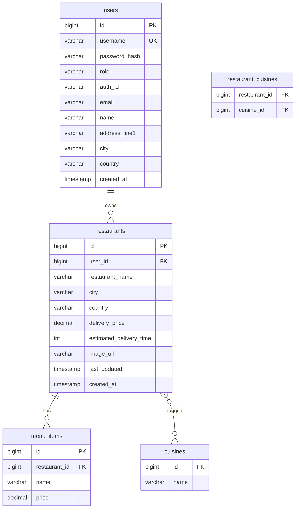

# 🍔 Food Order — Backend API

Ứng dụng đặt đồ ăn trực tuyến, backend xây dựng bằng **Spring Boot 3.2.5** với **MariaDB**.

---

## 📋 Mục lục

- [Tech Stack](#-tech-stack)
- [Yêu cầu hệ thống](#-yêu-cầu-hệ-thống)
- [Cài đặt & Chạy](#-cài-đặt--chạy)
- [Cấu hình](#-cấu-hình)
- [Cấu trúc dự án](#-cấu-trúc-dự-án)
- [API Endpoints](#-api-endpoints)
- [Database Schema](#-database-schema)
- [Frontend](#-frontend)

---

## 🛠 Tech Stack

| Layer        | Công nghệ                            |
| ------------ | ------------------------------------- |
| Framework    | Spring Boot 3.2.5                     |
| Language     | Java 17                               |
| Database     | MariaDB                               |
| ORM          | Spring Data JPA + Hibernate            |
| Build Tool   | Maven (Maven Wrapper included)         |
| Utilities    | Lombok 1.18.30                         |
| CORS         | Cho phép `localhost:4200` (Angular) và `localhost:5173` (Vite) |

---

## ✅ Yêu cầu hệ thống

- **Java 17** trở lên
- **MariaDB** đang chạy (port mặc định `3306`)
- Database `food_app` đã được tạo

---

## 🚀 Cài đặt & Chạy

### 1. Clone & di chuyển vào thư mục

```bash
cd "Food Order"
```

### 2. Tạo database

```sql
CREATE DATABASE IF NOT EXISTS food_app;
```

### 3. Chạy ứng dụng

```bash
# Windows
.\mvnw.cmd spring-boot:run

# Linux / macOS
./mvnw spring-boot:run
```

Server sẽ chạy tại **`http://localhost:8080`**.

### 4. Build JAR (tùy chọn)

```bash
.\mvnw.cmd package -DskipTests
java -jar target/FoodOrder-0.0.1-SNAPSHOT.jar
```

---

## ⚙ Cấu hình

File `src/main/resources/application.properties`:

| Property                          | Mặc định                             | Mô tả                        |
| --------------------------------- | ------------------------------------- | ----------------------------- |
| `spring.datasource.url`           | `jdbc:mariadb://localhost:3306/food_app` | JDBC URL                    |
| `spring.datasource.username`      | `root`                                | DB username                   |
| `spring.datasource.password`      | *(trống)*                             | DB password                   |
| `spring.jpa.hibernate.ddl-auto`   | `update`                              | Tự tạo/cập nhật bảng         |
| `spring.jpa.show-sql`             | `true`                                | Log SQL queries               |
| `server.port`                     | `8080`                                | Port server                   |

---

## 📁 Cấu trúc dự án

```
src/main/java/com/example/foodorder/
├── FoodOrderApplication.java          # Entry point
├── config/
│   └── CorsConfig.java                # CORS configuration
├── controllers/
│   ├── AuthController.java            # Đăng ký / Đăng nhập
│   ├── UserController.java            # CRUD users (admin)
│   ├── MyUserController.java          # Profile người dùng hiện tại
│   ├── RestaurantController.java      # CRUD restaurants (admin)
│   ├── MyRestaurantController.java    # Quản lý nhà hàng của chủ quán
│   ├── SubRestaurantController.java   # Tìm kiếm nhà hàng (public)
│   └── MenuItemController.java        # CRUD menu items
├── dto/
│   ├── CreateRestaurantRequest.java
│   ├── CreateUserRequest.java
│   ├── LoginRequest.java
│   ├── LoginResponse.java
│   ├── MenuItemResponse.java
│   ├── RegisterRequest.java
│   ├── RestaurantMapper.java          # Entity → DTO mapper
│   ├── RestaurantResponse.java
│   ├── RestaurantSearchResponse.java
│   └── UpdateUserRequest.java
├── entities/
│   ├── User.java                      # Người dùng (USER / RESTAURANT_OWNER)
│   ├── Restaurant.java                # Nhà hàng
│   ├── MenuItem.java                  # Món ăn
│   ├── Cuisine.java                   # Loại ẩm thực
│   ├── RestaurantCuisine.java         # Bảng nối nhiều-nhiều
│   └── RestaurantCuisineId.java       # Composite key
├── repositories/
│   ├── UserRepository.java
│   ├── RestaurantRepository.java      # Bao gồm search queries
│   └── MenuItemRepository.java
└── services/
    ├── UserService.java
    ├── RestaurantService.java
    ├── MenuItemService.java
    └── impl/
        ├── UserServiceImpl.java
        ├── RestaurantServiceImpl.java
        └── MenuItemServiceImpl.java
```

---

## 📡 API Endpoints

### 🔐 Authentication — `/api/auth`

| Method | Endpoint             | Mô tả                                     |
| ------ | -------------------- | ------------------------------------------ |
| POST   | `/api/auth/register` | Đăng ký tài khoản mới (USER / RESTAURANT_OWNER) |
| POST   | `/api/auth/login`    | Đăng nhập, trả về token                   |

**Register request body:**
```json
{
  "username": "user1",
  "password": "sha256_hex_hash",
  "email": "user@example.com",
  "name": "Nguyễn Văn A",
  "role": "USER"
}
```

**Login response:**
```json
{
  "token": "eyJ...",
  "userId": 1,
  "role": "USER",
  "username": "user1"
}
```

---

### 👤 User Profile — `/api/my/user`

> Yêu cầu header: `Authorization: Bearer <token>`

| Method | Endpoint        | Mô tả                        |
| ------ | --------------- | ----------------------------- |
| GET    | `/api/my/user`  | Lấy thông tin user hiện tại   |
| POST   | `/api/my/user`  | Tạo user (nếu dùng Auth0)    |
| PUT    | `/api/my/user`  | Cập nhật profile              |

---

### 🍽 My Restaurant — `/api/my/restaurant`

> Dành cho chủ nhà hàng. Yêu cầu header: `Authorization: Bearer <token>`

| Method | Endpoint              | Mô tả                          |
| ------ | --------------------- | ------------------------------- |
| GET    | `/api/my/restaurant`  | Lấy nhà hàng của mình          |
| POST   | `/api/my/restaurant`  | Tạo nhà hàng (1 user = 1 quán) |
| PUT    | `/api/my/restaurant`  | Cập nhật nhà hàng               |

**Create/Update request body:**
```json
{
  "restaurantName": "Pizza House",
  "city": "Ho Chi Minh",
  "country": "Vietnam",
  "deliveryPrice": 15000,
  "estimatedDeliveryTime": 30,
  "cuisines": ["Pizza", "Italian"],
  "menuItems": [
    { "name": "Margherita", "price": 120000 },
    { "name": "Pepperoni", "price": 150000 }
  ],
  "imageUrl": "https://example.com/image.jpg"
}
```

---

### 🔍 Search Restaurants — `/api/sub-restaurants`

| Method | Endpoint                                | Mô tả                                    |
| ------ | --------------------------------------- | ----------------------------------------- |
| GET    | `/api/sub-restaurants/{id}`             | Chi tiết 1 nhà hàng                      |
| GET    | `/api/sub-restaurants/search/{city}`    | Tìm theo thành phố (có filter & sort)     |
| GET    | `/api/sub-restaurants/search`           | Tìm kiếm tổng hợp (tên, thành phố, món ăn) |

**Query parameters (search):**

| Param              | Default     | Mô tả                                    |
| ------------------ | ----------- | ----------------------------------------- |
| `q` / `searchQuery`| `""`        | Từ khóa tìm (tên nhà hàng hoặc món ăn)  |
| `selectedCuisines` | `""`        | Filter theo loại ẩm thực, ngăn cách bằng `,` |
| `sortOption`       | `bestMatch` | Sắp xếp: `bestMatch`, `deliveryPrice`, `estimatedDeliveryTime`, `lastUpdated` |
| `page`             | `1`         | Trang (1-indexed), mỗi trang 10 kết quả |

**Response:**
```json
{
  "data": [
    {
      "id": 1,
      "restaurantName": "Pizza House",
      "city": "Ho Chi Minh",
      "country": "Vietnam",
      "deliveryPrice": 15000,
      "estimatedDeliveryTime": 30,
      "cuisines": ["Pizza", "Italian"],
      "menuItems": [
        { "id": 1, "name": "Margherita", "price": 120000 }
      ],
      "imageUrl": "...",
      "lastUpdated": "2026-02-20T10:00:00Z"
    }
  ],
  "pagination": {
    "total": 25,
    "page": 1,
    "pages": 3
  }
}
```

---

### 🛠 Admin CRUD

#### Users — `/api/users`

| Method | Endpoint         | Mô tả              |
| ------ | ---------------- | ------------------- |
| GET    | `/api/users`     | Lấy tất cả users   |
| GET    | `/api/users/{id}`| Lấy user theo ID   |
| POST   | `/api/users`     | Tạo user            |
| PUT    | `/api/users/{id}`| Cập nhật user       |
| DELETE | `/api/users/{id}`| Xoá user            |

#### Restaurants — `/api/restaurants`

| Method | Endpoint              | Mô tả                   |
| ------ | --------------------- | ------------------------ |
| GET    | `/api/restaurants`    | Lấy tất cả nhà hàng     |
| GET    | `/api/restaurants/{id}`| Lấy nhà hàng theo ID   |
| POST   | `/api/restaurants`    | Tạo nhà hàng             |
| PUT    | `/api/restaurants/{id}`| Cập nhật nhà hàng       |
| DELETE | `/api/restaurants/{id}`| Xoá nhà hàng            |

#### Menu Items — `/api/menu-items`

| Method | Endpoint                                  | Mô tả                         |
| ------ | ----------------------------------------- | ------------------------------ |
| GET    | `/api/menu-items`                         | Lấy tất cả món                |
| GET    | `/api/menu-items/{id}`                    | Lấy món theo ID               |
| GET    | `/api/menu-items/restaurant/{restaurantId}`| Lấy menu theo nhà hàng       |
| POST   | `/api/menu-items`                         | Tạo món                       |
| PUT    | `/api/menu-items/{id}`                    | Cập nhật món                  |
| DELETE | `/api/menu-items/{id}`                    | Xoá món                       |

---

## 🗄 Database Schema



---

## 🖥 Frontend

Frontend Angular riêng biệt nằm tại thư mục **`Food-Order-Frontend`**.

```bash
cd Food-Order-Frontend
npm install
ng serve    # → http://localhost:4200
```

> Backend phải đang chạy tại `http://localhost:8080` để frontend kết nối được.
